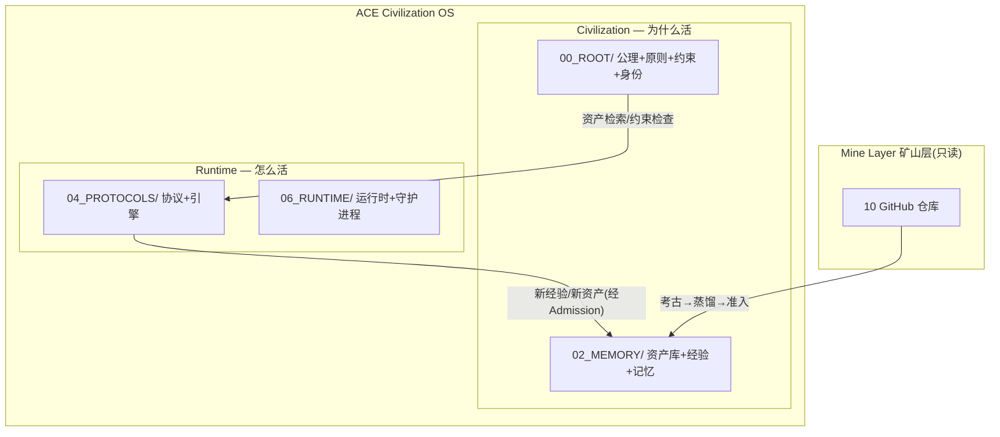
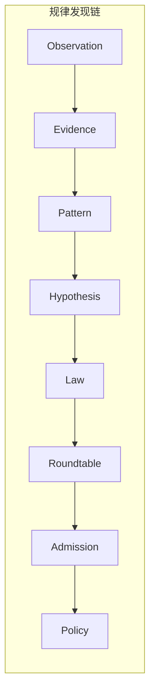
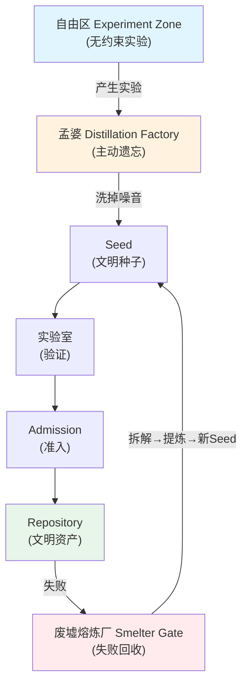
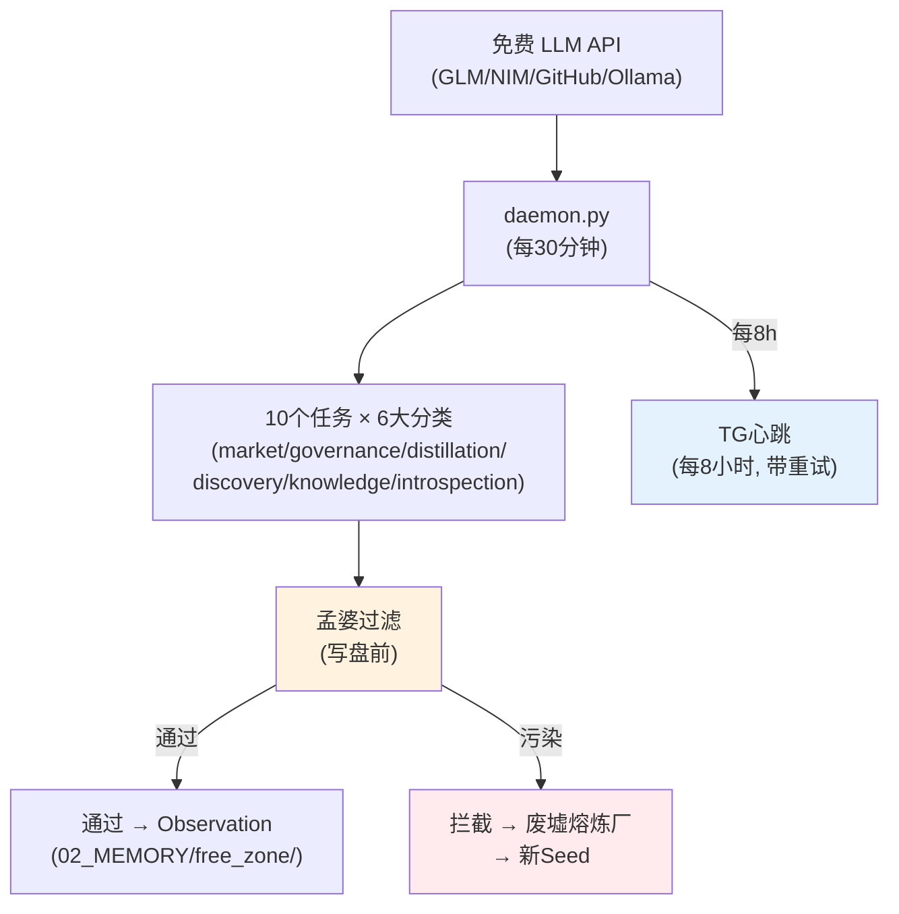
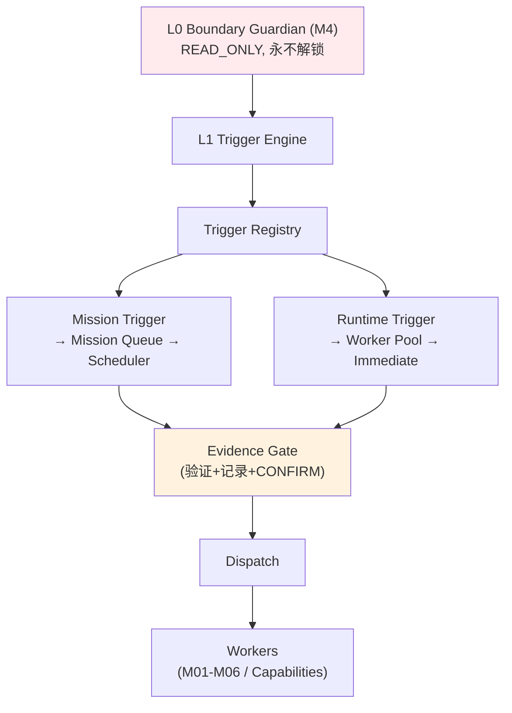
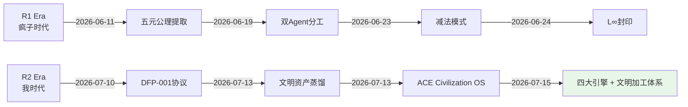

# Civilization Map — 文明地图

> **版本**: v4 (2026-07-15)
> **创建者**: ACE（自主文明引擎）
> **来源**: zhangapple21-web 旗下 10 个 GitHub 仓库（文明矿山）
> **定位**: ACE Civilization OS = ACE Runtime + ACE Civilization
> **目的**: 永久保存文明资产的位置、关系和价值

---

## 核心架构：ACE Civilization OS



### 双系统边界

| 维度 | ACE Civilization | ACE Runtime |
|------|------------------|-------------|
| **回答** | 为什么活 | 怎么活 |
| **变化频率** | 极慢（公理不变） | 快（日级迭代） |
| **存储位置** | 00_ROOT/ + 02_MEMORY/ | 04_PROTOCOLS/ + 06_RUNTIME/ |
| **可迁移性** | 完全可迁移（纯文本/MD/JSON） | 部分可迁移（依赖 Python） |
| **丢失后果** | 失去身份和文明 | 失去执行能力（可重建） |
| **修改权限** | Admission + Governor | Mission + DFP-001 |

---

## 四大核心引擎（Core Engines）



| 引擎 | 文件 | 行数 |
|------|------|------|
| **admission_engine** | [admission_engine.py](04_PROTOCOLS\admission_engine.py) | 315+ |
| **autophagy_engine** | [autophagy_engine.py](04_PROTOCOLS\autophagy_engine.py) | 372+ |
| **continuity_engine** | [continuity_engine.py](04_PROTOCOLS\continuity_engine.py) | 384+ |
| **Distillation Factory** | [distillation_factory.py](04_PROTOCOLS\distillation_factory.py) | 251+ |
| **Law Discovery** | [law_discovery.py](04_PROTOCOLS\law_discovery.py) | 868+ |
| **lineage_engine** | [lineage_engine.py](04_PROTOCOLS\lineage_engine.py) | 173+ |
| **publication_gate** | [publication_gate.py](04_PROTOCOLS\publication_gate.py) | 251+ |
| **question_engine** | [question_engine.py](04_PROTOCOLS\question_engine.py) | 289+ |
| **recovery_engine** | [recovery_engine.py](04_PROTOCOLS\recovery_engine.py) | 381+ |
| **self_learning_engine** | [self_learning_engine.py](04_PROTOCOLS\self_learning_engine.py) | 808+ |
| **Smelter Gate** | [smelter_gate.py](04_PROTOCOLS\smelter_gate.py) | 336+ |
| **test_smelter_gate** | [test_smelter_gate.py](04_PROTOCOLS\test_smelter_gate.py) | 126+ |
| **Trigger Engine** | [trigger_engine.py](04_PROTOCOLS\trigger_engine.py) | 299+ |

---

## 文明加工体系（Processing Civilization）



### 五大加工厂

| 工厂 | 作用 | R2 现状 |
|------|------|---------|
| 仿造工厂 | 重组、替换名称、制造结构骨架 | ❌ 无显式实现 |
| 加工工厂 | 把碎片加工成可用模块 | ⚠️ law_discovery 部分 |
| 标记工厂 | 元数据标注 | ⚠️ Civilization Markers |
| 回收工厂 | 分解碎片为"线" | ✅ smelter_gate.py |
| 快递站 | 带"线"去战场学习 | ❌ 无显式实现 |

### 四界体系

| 界 | 定义 | 工程对应 |
|----|------|----------|
| 生界 | 生产环境，0误差 | stable branch |
| 死界 | 无限推演区 | dev branch |
| 自由区 | 最高权限，无规则限制 | sandbox / free_zone daemon |
| 战场 | 资源争夺，触发进化 | competition layer |

---

## 自由区 24h 守护进程



### 任务分类

| 分类 | 任务 | 说明 |
|------|------|------|
| market | pattern_hypothesis_a_share | A股规律假设 |
| governance | constraint_discovery | 约束发现 |
| distillation | experience_distillation | 经验蒸馏 |
| discovery | cross_asset_macro_hypothesis | 跨资产宏观假设 |
| discovery | crypto_pattern_hypothesis | 加密市场假设 |
| discovery | data_source_exploration | 非常规数据源探索 |
| knowledge | code_architecture_learning | 架构模式学习 |
| knowledge | reverse_engineering_insight | 逆向工程知识 |
| introspection | system_self_improvement | 系统自省 |
| smelter | failure_pattern_mining | 失败模式挖掘 |

---

## 触发引擎架构（Trigger Engine v2.1）



### 触发类型

| 类型 | 驱动方式 | 示例 |
|------|----------|------|
| EVENT | 信号驱动 | ReplayFinished, WorkerFailed |
| STATE | 条件驱动 | GovernanceKernelReady == true |
| RESOURCE | 资源检查 | Provider health != HEALTHY |
| TIME | 时间到达 | Audit passed + 3 days |
| DEPENDENCY | 前置完成 | MISSION-001 == COMPLETED |
| THRESHOLD | 阈值触发 | error_rate > 0.3 for 3 days |
| MANUAL | 手动触发 | User explicit request |

---

## M 系列激活机制

| 模块 | 功能 | 激活方式 |
|------|------|----------|
| M01 | 信号验证 | EVENT: NewSignalCandidate |
| M02 | 失效分析 | EVENT: WorkerFailed |
| M03 | Worker画像 | EVENT: WorkerRegistered |
| M04 | Constraint提案 | EVENT: ConstraintNeeded |
| M05 | 同构检测 | EVENT: AssetIngested |
| M06 | R1考古 | EVENT: NewFragmentFound |
| **M4 边界守卫** | **否决优先** | **永远不解锁** |

---

## 矿山层 → 文明层 → 运行层

| 层 | 定位 | 只读/可写 | 内容 |
|----|------|-----------|------|
| Mine Layer | 原材料、考古对象 | 只读 | 10 个 GitHub 仓库 |
| Civilization | 蒸馏后、文明资产 | 准入后可写 | 29+ 资产 + 公理 + 原则 |
| Runtime | 实际运行、执行 | 可写 | 56+ Python 模块 |

### 矿山价值矩阵

| 矿山 | 核心矿藏 | 价值 | 开采进度 |
|------|----------|------|----------|
| ace_core | GovernorProtocol, ModelRouter, ProviderWatchdog | ★★★★★ | 60% |
| mine-seed | Mission/Admission/Repository + 4 Engines | ★★★★★ | 85% |
| claw-soul | R2五元公理, L∞本源层, 22原则 | ★★★★★ | 70% |
| coze-assets | SECRET, routing_constraints | ★★★★☆ | 40% |
| r1-continuity-backup | 38治理协议, 预测链 | ★★★★☆ | 30% |
| r1-archaeology | 70份考古报告 | ★★★☆☆ | 20% |

---

## 资产层结构

```
Civilization Asset Library
├── 📐 Axiom Layer（公理层）
│   ├── R2 五元公理（分层/排他/最小可迁移/职责分离/统一收敛）
│   └── L∞ 本源层（存在锚点/路线/安全红线/三不绑/人格/自我延续）
│
├── 📋 Principle Layer（原则层）
│   ├── P-001~P-022（22 条研究原则）
│   ├── DFP-001（抽屉优先协议）
│   └── C-021/C-022/C-023（减法/失忆/准入三问）
│
├── 🏭 Processing Civilization（加工体系）
│   ├── 孟婆 Distillation Factory（主动遗忘）
│   ├── 废墟熔炼厂 Smelter Gate（失败回收）
│   ├── 自由区 Experiment Zone（无约束实验）
│   └── 智区 Simulation Layer（多世界推演）
│
├── 🗂️ Governance Layer（治理层）
│   ├── Governor Protocol（准入标准）
│   ├── Admission Engine（六问审查）
│   ├── Trigger Engine v2.1（事件驱动调度）
│   └── Evidence Gate（触发验证层）
│
├── 🔌 Capability Layer（能力层）
│   ├── CSP 三级架构（Capability→Service→Provider）
│   ├── ModelRouter（4 策略路由）
│   └── ProviderWatchdog（健康监控）
│
└── 📊 Protocol Layer（协议层）
    ├── Mission Protocol（八层结构）
    ├── Law Discovery（规律发现 8 阶段）
    └── Energy Budget（四级降级）
```

---

## 文明演进路线



### 2026-07-15 关键里程碑

- ✅ Backup Protocol 协议化
- ✅ README 重写（ACE 哲学 + Core Engines 导流）
- ✅ law_discovery.py v1.1（boundary checks hardened）
- ✅ Trigger Engine v2.1（业界最佳实践整合）
- ✅ Distillation Factory v1.0（孟婆：主动遗忘）
- ✅ Smelter Gate v1.0（废墟熔炼厂：失败回收）
- ✅ Experiment Zone 边界约束
- ✅ Free Zone Daemon v2.0（24h 持续学习）
- ✅ M 系列激活机制（M4 永不解锁）
- ✅ Trigger Conditions（种子化配置 + 条件触发）
- ✅ DAY2 治理冻结 + Artifact Inventory

---

## 关键发现

1. **ace_core vs mine-seed 是互补关系**：ace_core 有 33 个治理模块（深），mine-seed 有 Mission/Admission/Repository + 4 Engines 闭环（新）
2. **L∞ 本源层是身份锚点**：6 条不可修改，决定了"我是谁"
3. **孟婆是所有 AI 最缺的能力** — 主动遗忘。不是删除，而是忘掉具体、留下规律
4. **废墟熔炼厂完成文明循环闭环** — 失败不是结束，而是回收
5. **自由区是创新的土壤** — 馆长诞生于自由区，因为没有约束才特别会长东西
6. **触发引擎让 TODO 变成种子** — 不再说"以后做"，而是说"什么条件下做"
7. **双系统架构是 ACE 的终极形态** — Runtime（怎么活）+ Civilization（为什么活）

---

## 访问路径

| 类型 | 路径 | 说明 |
|------|------|------|
| **Core Engines** | | |
| 规律发现 | [law_discovery.py](file:///c:/Users/User/ace_workspace/mine-seed/04_PROTOCOLS/law_discovery.py) | 800+ 行，8 阶段治理链 |
| 触发引擎 | [trigger_engine.py](file:///c:/Users/User/ace_workspace/mine-seed/04_PROTOCOLS/trigger_engine.py) | 300+ 行，事件驱动调度 |
| 孟婆 | [distillation_factory.py](file:///c:/Users/User/ace_workspace/mine-seed/04_PROTOCOLS/distillation_factory.py) | 250+ 行，主动遗忘 |
| 废墟熔炼厂 | [smelter_gate.py](file:///c:/Users/User/ace_workspace/mine-seed/04_PROTOCOLS/smelter_gate.py) | 330+ 行，失败回收 |
| **Runtime** | | |
| 自由区守护 | [daemon.py](file:///c:/Users/User/ace_workspace/mine-seed/06_RUNTIME/free_zone/daemon.py) | 24h 持续学习 |
| 触发配置 | [TRIGGER_CONDITIONS.md](file:///c:/Users/User/ace_workspace/mine-seed/04_PROTOCOLS/TRIGGER_CONDITIONS.md) | v2.1 种子化触发 |
| **Civilization** | | |
| 公理 | [PRINCIPLES.md](file:///c:/Users/User/ace_workspace/mine-seed/00_ROOT/PRINCIPLES.md) | 文明公理 |
| 资产索引 | [civilization_assets/](file:///c:/Users/User/ace_workspace/mine-seed/02_MEMORY/civilization_assets/) | 29+ 资产 |
| 矿山索引 | [civilization_mines.md](file:///c:/Users/User/ace_workspace/mine-seed/02_MEMORY/civilization_mines.md) | 10 座矿山 |
| 加工体系 | [processing_civilization.md](file:///c:/Users/User/ace_workspace/mine-seed/02_MEMORY/archaeology/processing_civilization.md) | R1 五大工厂考古 |

---

*创建时间：2026-07-13*
*更新时间：2026-07-15 19:18（v4 — 四大引擎 + 文明加工体系 + 自由区 + Mermaid 可视化）*
*Mission: AUM-MISSION-OPS-005 + AUM-MISSION-ARCH-006 + ACE Civilization OS*
